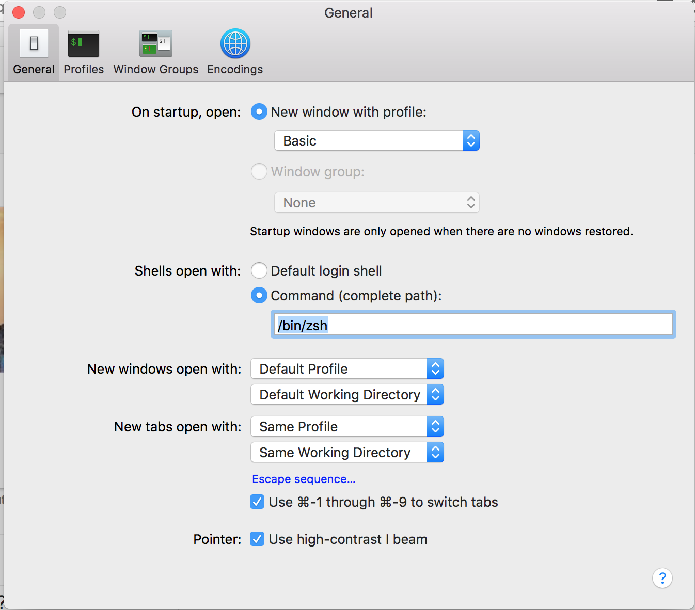

### install brew

### Install oh-my-zsh

1. follow [this instruction](https://github.com/YanlongLi/SetupYourLinux#zsh--on-my-zsh) to install
2. if you need tmux and want ctrl-s for tmux prefix, you need enable ctrl-s and ctrl-q in terminal by adding `stty -ixon -ixoff` in ~/.bashrc
3. set zsh as default shell: `chsh`
4. set `zsh` as startup terminal in `Terminal->Preference->General->Sheels open with->Command->/bin/zsh`

5. You may also want to execute `tmux -u` on terminal startup

6. You may also want to adjust the opacity and blur of terminal, which is very useful.

### install mactex / texlive

### install shadowsocks

```
brew install shadowsocks-libev
## change file /usr/local/etc/shadowsocks-libev.json
brew services start shadowsocks-livev
```

### install mactex/texlive
#### install fontawesome font, [link](https://medium.com/@davidjwoody/photoshop-is-dead-how-to-use-keynote-with-font-awesome-d1570d25f45b)

### Zoom shortcut
add `Command+Down` shortcut for Zooom, How: follow [this article](http://osxdaily.com/2013/03/22/5-simple-window-management-keyboard-shortcuts-to-improve-workflow-in-mac-os-x/)

### Reverse the scroll direction if you are not used to it.

Uncheck `System Preference -> TrackPad -> Scroll Direction: Natual`
